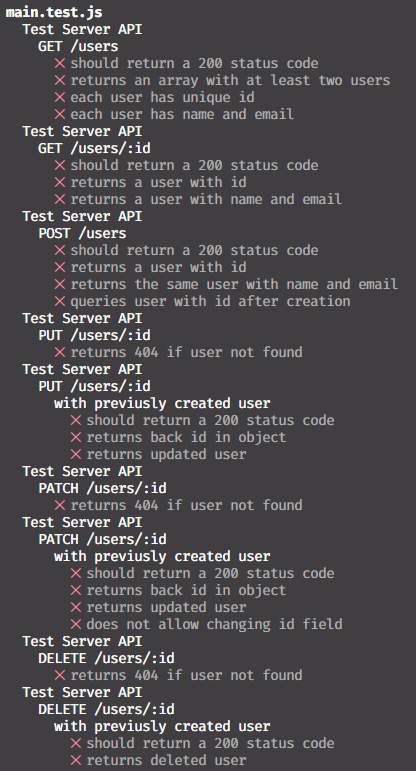

# Kernel - Javascript & HTTP

## Uwaga!
### Na początku spróbuj samodzielnie wyszukać w dostępnych źródłach jak zrealizować zadanie. Dopiero gdy nie uda Ci się tego zrobić, skorzystaj z podpowiedzi
### Nie krępuj się i pytaj opiekunów warsztatów o dowolną pomoc i wyjaśnienie

## Setup

Sklonuj repozytorium na swój komputer

```bash
git clone https://github.com/Critteros/Kernel-JS-HTTP.git
cd Kernel-JS-HTTP
code .
```

Sprawdź czy są zainstalowane node.js i npm

```bash
node -v
npm -v
```

W przypadku gdy któregoś z nich nie ma, zgłoś się do opiekuna warsztatów

Następnie zainstaluj wymagane biblioteki

```bash
npm install
```

## Opis zadania

W ramach zadania stworzony zostanie prosty server HTTP z wykorzystaniem biblioteki Express.js. Server ten będzie udostępniał zasoby które pozwolą na odczyt, stworzenie, edycję i usunięcie użytkowników (CRUD)

Pojedynczy użytkonwik jest reprezentowany przez następujący obiekt:

```javascript
{
    id: 1, // Unikalny identyfikator użytkownika
    name: "John Doe", // Nick
    email: "john@example.com", // Email
}
```

Obiekty będą przechowywane w zmiennej globalnej `data`. Każdy restart serwera powoduje zresetowanie tej zmiennej do stanu początkowego

W pliku `main.js` znajduje się szkielet aplikacji. Twoim zadaniem będzie uzupełnienie go o brakujące funkcjonalności wymienione poniżej i doprowadzenie aby wszystkie testy w pliku `main.test.js` przechodziły pomyślnie.

Testy uruchamia się poprzez polecenie `npm test`, a ich wyniki będą widoczne w konsoli



Aby uruchomić serwer należy skorzystać z komendy `npm start`, tak uruchomiony serwer będzie nasłuchiwać połączeń pod adresem `http://127.0.0.1:9000`. Podczas modfyfikacji kodu nie trzeba uruchamiać serwera ponownie, restart serwera nastąpi automatycznie po każdej zmianie w pliku `main.js`

W celu manualnego wykonywani zapytań HTTP można skorzystać z extensiona Thunder Client dla VSCode.
Extension ten można zainstalować poprzez panel rozszerzeń lub korzystając z poniższej komendy

[](https://marketplace.visualstudio.com/items?itemName=rangav.vscode-thunder-client)

```bash
code --install-extension rangav.vscode-thunder-client
```

Po zaimplementowaniu wszystkich funkcjonalności, wszystkie testy powinny przechodzić pomyślnie


## Przydatne frgamenty kodu


```javascript
res.json(obiekt) // Odsłyłanie obiektu w formacie JSON
res.status(201).json(obiekt) // Odsyłanie obiektu w formacie JSON z kodem odpowiedzi 201

req.params.id // Pobranie parametru z adresu URL z pola :id
req.body // Pobranie ciała zapytania

arr.splice(index, 1) // Usunięcie jendego elementu z tablicy o indeksie index
arr.push(element) // Dodanie elementu na koniec tablicy
arr.find(element => element.id === id) // Znalezienie elementu w tablicy
arr.filter(element => element.id !== id) // Usunięcie elementu z tablicy

parseInt(string) // Konwersja stringa na liczbę
```


## Zadania

### 1. GET /users

Zaimplementuj endpoint `/users` który zwróci listę wszystkich użytkowników w formacie JSON.
Status odpowiedzi powinien być równy ***200 (HTTP OK)***

Przykład odpowiedzi:

```json
// GET /users
[
  {
    "id": 1,
    "name": "John Doe",
    "email": "john@example.com",
  },
  {
    "id": 2,
    "name": "Jane Doe",
    "email": "jane@example.com",
  },
]
```

<details>
<summary>Rozwiązanie</summary>

```js
app.get("/users", (req, res) => {
    res.json(data);
});
```

</details>


### 2. GET /users/:id

Zaimplementuj endpoint `/users/:id` który zwróci użytkownika o podanym id w formacie JSON i kodzie odpowiedzi równym ***200 (HTTP OK)***.
W przypadku gdy użytkownik o podanym id nie istnieje, status odpowiedzi powinien być równy ***404 (HTTP Not-Found)***. Odpowiedź w takim przyapdku powinanna zawierać informacje o zainstniałym błędzie

Przykład odpowiedzi:

```json
// GET /users/1
{
  "id": 1,
  "name": "John Doe",
  "email": "john@example.com",
}
```

<details>
<summary>Rozwiązanie</summary>

```js
app.get("/users/:id", (req, res) => {
  const id = parseInt(req.params.id);
  const user = data.find((user) => user.id === id);
  res.json(user);
});
```

</details>

### 3. POST /users

Zaimplementuj endpoint `/users` który stworzy nowego użytkownika na podstawie danych przesłanych w ciele zapytania. Odpowiedź serwera powinna mieć kod 201 ***(HTTP Created)*** oraz powinna zawierać w ciele obiekt użytkownika który został stworzony. Dodatkowo server dodaje do stworzonego obiektu pole `id` które jest unikalnym identyfikatorem użytkownika. Identyfikator ten można ustalić znajdując obecnie największy identyfikator w tablicy `data` i zwiększając go o 1.

Przykład
```json
// Request
POST /users
{
  "name": "John Doe",
  "email": "john@example.com"
}
```

```json
// Response
201 Created
{
  "id": 7,
  "name": "John Doe",
  "email": "john@example.com",
}
```

<details>
<summary>Rozwiązanie</summary>

```js
app.post("/users", (req, res) => {
  const reqData = req.body;
  const nextId = data.reduce((max, user) => Math.max(user.id, max), 0) + 1;
  const newUser = { ...reqData, id: nextId };
  data.push(newUser);
  res.status(201).json(newUser);
});
```

</details>

### 4. PUT /users/:id

Zaimplementuj endpoint `/users/:id` który zastąpi dane użytkownika o podanym id na podstawie danych przesłanych w ciele zapytania. Odpowiedź serwera powinna mieć kod ***200 (HTTP OK)*** oraz powinna zawierać w ciele obiekt użytkownika który został zaktualizowany. W przypadku gdy użytkownik o podanym id nie istnieje, status odpowiedzi powinien być równy ***404 (HTTP Not Found)***. Należy zadbać o to aby użytkownikowi nie zostało zmienione pole `id`, w przypadku gdy w ciele zapytania znajduje się pole `id` należy odesłać odpowiedź z kodem ***406 (HTTP Not Acceptable)***.

Przykład
```json
// Request
PUT /users/1
{
  "name": "Updated John",
  "email": "john@example.com",
  "id": 7
}
```

```json
// Response
406 Not Acceptable
ID cannot be updated
```

```json
PUT /users/1
{
  "name": "Updated John",
  "email": "john-2@example.com",
}
```

```json
// Response
200 OK
{
  "id": 1,
  "name": "Updated John",
  "email": "john-2@example.com"
}
```

<details>
<summary>Rozwiązanie</summary>

```js
app.put("/users/:id", (req, res) => {
  const id = parseInt(req.params.id);
  const reqData = req.body;
  const index = data.findIndex((user) => user.id === id);

  if (reqData.id) {
    return res.status(406).send("ID cannot be updated");
  }

  if (index !== -1) {
    const updatedUser = { ...reqData, id };
    data[index] = updatedUser;
    res.json(data[index]);
  } else {
    res.status(404).send("User not found");
  }
});
```

</details>


### 5. PATCH /users/:id

Zaimplementuj endpoint `/users/:id` który zaktualizuje użytkownika o podanym id na podstawie danych przesłanych w ciele zapytania. Odpowiedź serwera powinna mieć kod ***200 (HTTP OK)*** oraz powinna zawierać w ciele obiekt użytkownika który został zaktualizowany. W przypadku gdy użytkownik o podanym id nie istnieje, status odpowiedzi powinien być równy ***404 (HTTP Not Found)***. Należy zadbać o to aby użytkownikowi nie zostało zmienione pole `id`, w przypadku gdy w ciele zapytania znajduje się pole `id` należy odesłać odpowiedź z kodem ***406 (HTTP Not Acceptable)***.

Przykład
```json
// Request
PATCH /users/1
{
  "name": "Updated John",
  "id": 7
}
```

```json
// Response
406 Not Acceptable
ID cannot be updated
```

```json
PUT /users/1
{
  "name": "Updated John",
}
```

```json
// Response
200 OK
{
  "id": 1,
  "name": "Updated John",
  "email": "john@example.com"
}
```

<details>
<summary>Rozwiązanie</summary>

```js
app.patch("/users/:id", (req, res) => {
  const id = parseInt(req.params.id);
  const reqData = req.body;

  if (reqData.id) {
    return res.status(406).send("ID cannot be updated");
  }

  const index = data.findIndex((user) => user.id === id);
  if (index !== -1) {
    // Merge existing fields with updated fields
    data[index] = { ...data[index], ...reqData };
    res.json(data[index]);
  } else {
    res.status(404).send("User not found");
  }
});
```

</details>

### 6. DELETE /users/:id

Zaimplementuj endpoint `/users/:id` który usunie użytkownika o podanym id. Odpowiedź serwera powinna mieć kod ***200 (HTTP OK)*** oraz powinna zawierać w ciele obiekt użytkownika który został usunięty. W przypadku gdy użytkownik o podanym id nie istnieje, status odpowiedzi powinien być równy ***404 (HTTP Not Found)***.

Przykład
```json
// Request
DELETE /users/1
```

```json
// Response
200 OK
{
  "id": 1,
  "name": "John Doe",
  "email": "john@example.com"
}
```

<details>
<summary>Rozwiązanie</summary>

```js
app.delete("/users/:id", (req, res) => {
  const id = parseInt(req.params.id);
  const index = data.findIndex((user) => user.id === id);
  if (index !== -1) {
    const deletedUser = data.splice(index, 1)[0];
    res.json(deletedUser);
  } else {
    res.status(404).send("User not found");
  }
});
```

</details>